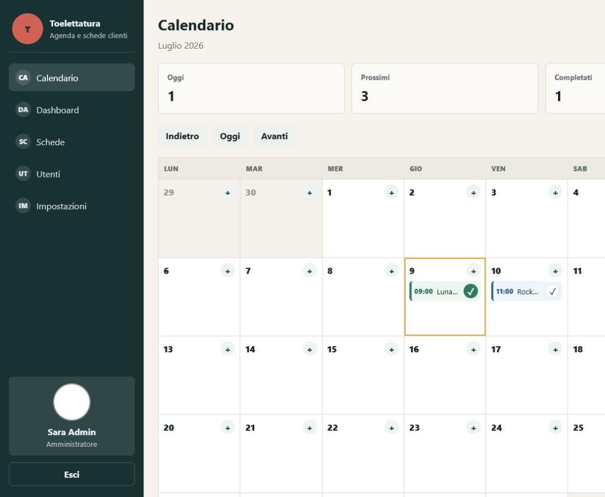
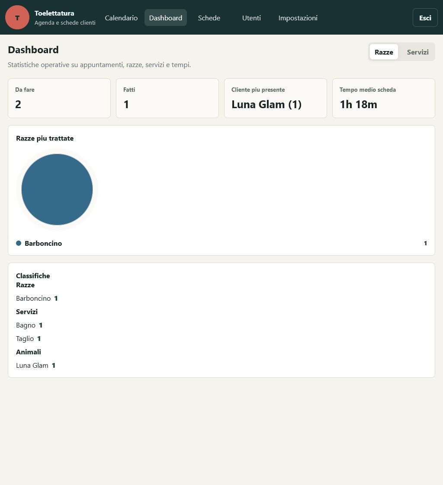
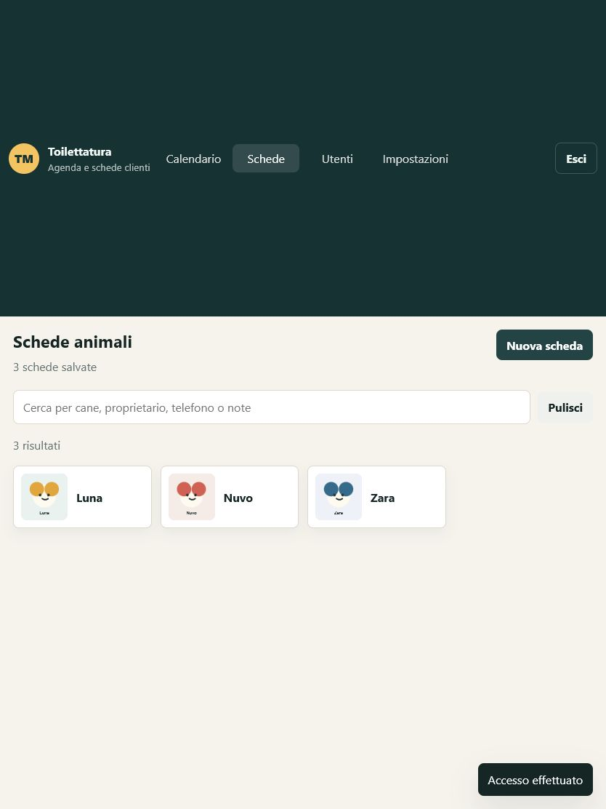
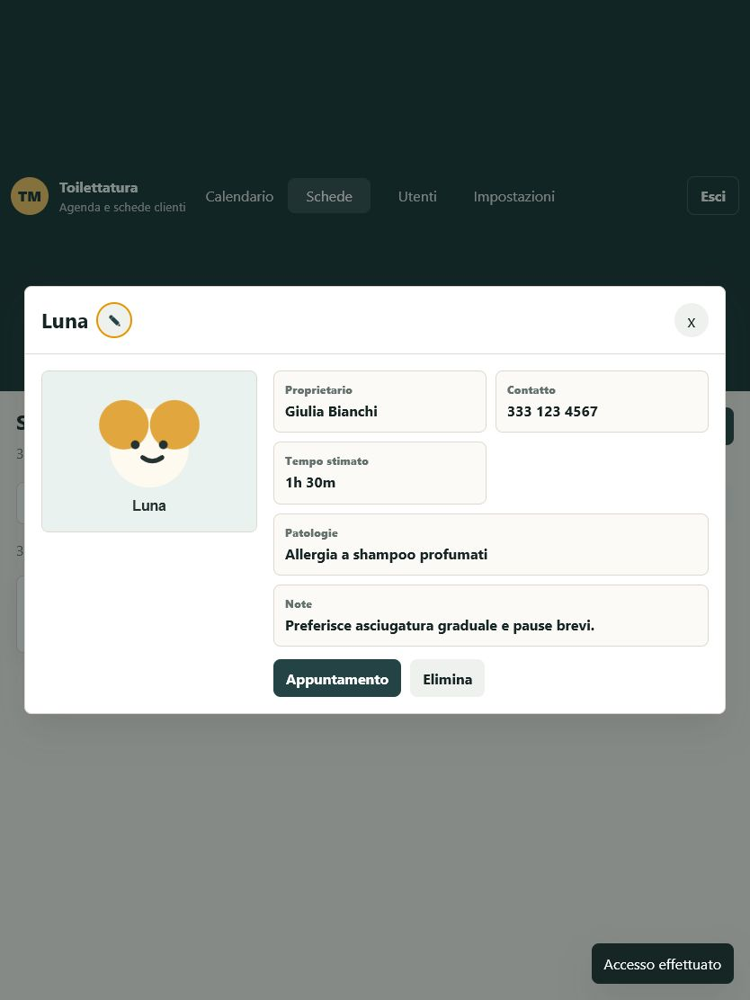
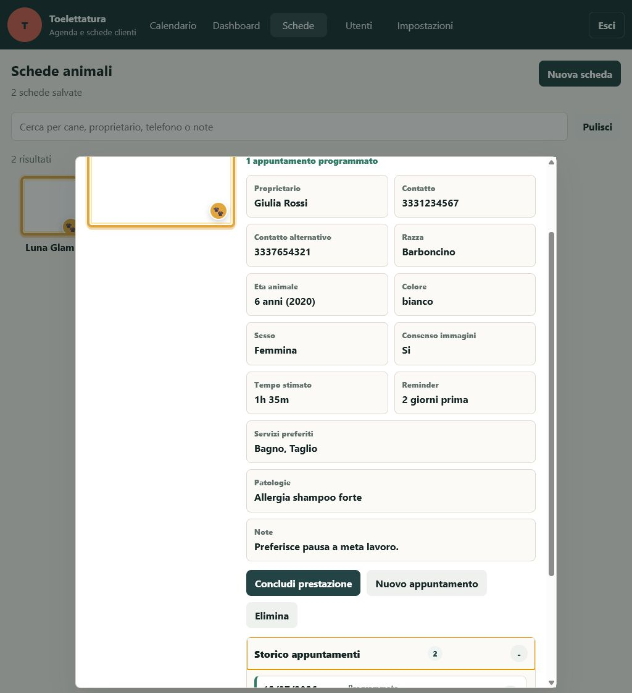
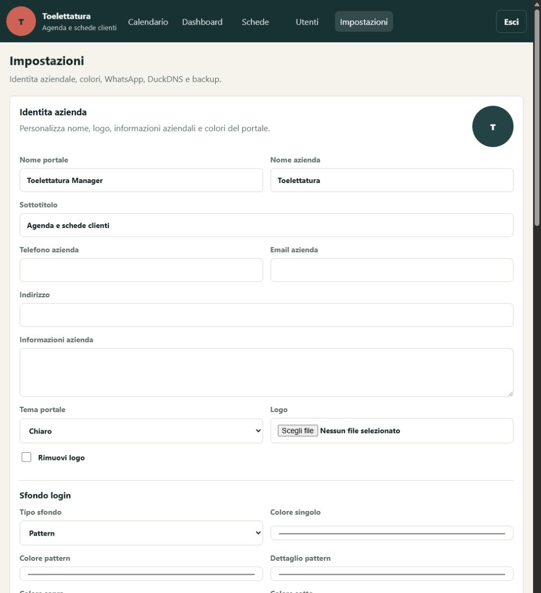
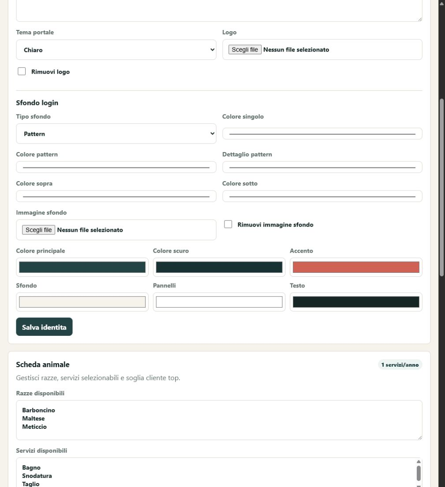
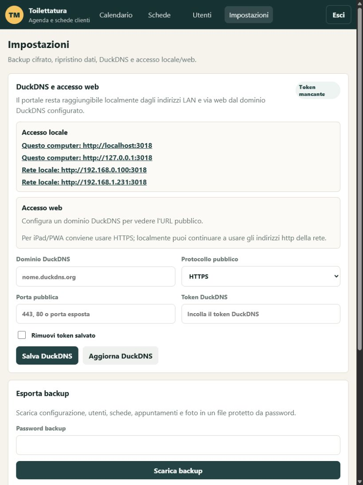
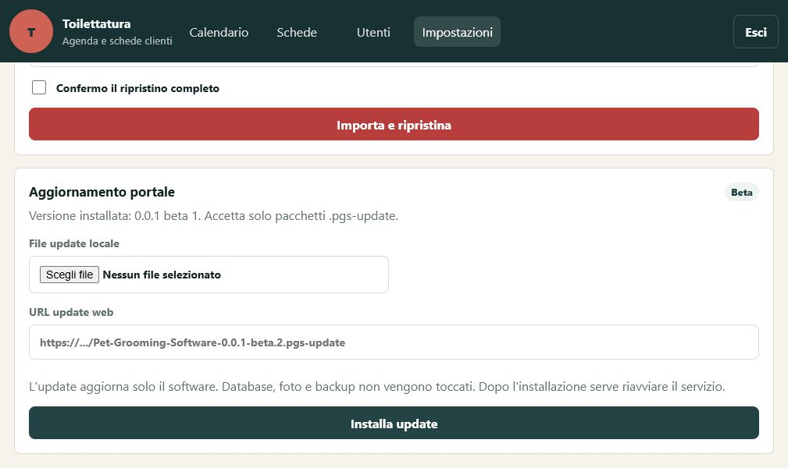
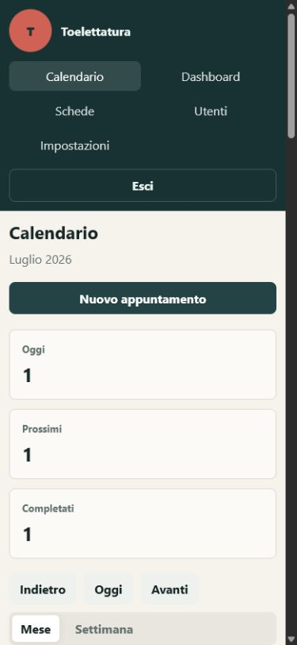

# Groomly

Release corrente: `0.0.1 beta 19` (`0.0.1-beta.19`).

Portale web PWA in Node.js per gestire:

- login amministratore e operatori;
- login rapido da tendina utenti con inserimento della sola password;
- foto profilo utenti visibile nella sidebar e stato online in lista utenti;
- personalizzazione logo, colori, tema chiaro/scuro con accenti cromatici, sfondo login, nome portale e dati azienda;
- aggiornamento live multiutente di schede, appuntamenti, utenti e impostazioni;
- calendario appuntamenti con vista desktop/iPad e agenda compatta su iPhone;
- menu mobile persistente in basso con icone tonde su una riga scorrevole e ancoraggio dedicato per iPhone/PWA;
- icone menu per calendario, dashboard, schede, storico servizi e utenti;
- dashboard statistiche con priorita a servizi e incassi, grafici piu leggibili, incasso separato per servizio, andamento incassi giorno/settimana/mese/anno, servizi fatti/da fare, razze, servizi piu usati, animale piu presente con mini foto, cane piu redditizio e tempi medi;
- schede animali con foto, cornice cliente top manuale o automatica, razza, eta, colore, sesso, contatti, patologie, tempi stimati, reminder WhatsApp e consenso immagini;
- impostazioni scheda animale per razze, colori cane, prestazioni cumulabili e soglia cliente top;
- storico appuntamenti a menu nella scheda cane con servizio eseguito, importo pagato, galleria foto prima/dopo e foto ingrandibili;
- sezione `Storico servizi` con ricerca animale a suggerimenti, riepilogo incasso e foto zoomabili;
- chiusura prestazione da scheda cane o calendario con servizi precompilati, modificabili e prezzo separato per ogni servizio;
- ricerca schede;
- backup cifrato con password e import backup;
- impostazioni WhatsApp per promemoria appuntamenti;
- aggiornamento software da file locale o release GitHub con pacchetto `.pgs-update`;
- notifica nel pannello impostazioni e badge sidebar quando e disponibile un nuovo update web;
- changelog visibile nel controllo update web insieme alla nuova versione;
- popup PWA quando una nuova versione dell'app e pronta, con aggiornamento senza reinstallazione;
- layout desktop, mobile e iPad;
- icona PWA/iPhone e badge cliente top con zampa personalizzata trasparente.

## Anteprime

Le immagini del portale sono salvate in `docs/screenshots/` e vanno aggiornate a ogni release.

| Vista | Anteprima |
| --- | --- |
| Desktop |  |
| Dashboard iPad |  |
| Schede in miniature |  |
| Scheda cane in popup |  |
| Storico appuntamenti |  |
| Identita portale |  |
| Scheda animale |  |
| DuckDNS |  |
| Aggiornamento portale |  |
| Agenda iPhone |  |

## Accesso iniziale

- Amministratore: `admin` / `admin123`
- Operatore: `operatore` / `operatore123`

Al primo accesso con la password admin di default il portale mostra un avviso e obbliga il cambio password.

Il riquadro con le credenziali iniziali nella schermata login appare solo finche l'admin usa ancora la password di default. Dopo il primo cambio password non viene piu mostrato.

## Avvio rapido

Serve Node.js 18 o superiore.

### Windows

Apri il prompt nella cartella del portale e avvia:

```powershell
node server.js
```

In alternativa usa `start-windows.bat`.

### Linux

Apri il terminale nella cartella del portale e avvia:

```bash
node server.js
```

In alternativa:

```bash
sh start-linux.sh
```

## Pacchetti installativi

Per creare i pacchetti di distribuzione:

```powershell
npm.cmd run release:packages
```

Il comando genera nella cartella `dist/`:

- `Pet-Grooming-Software-0.0.1-beta.19-windows.zip`;
- `Pet-Grooming-Software-0.0.1-beta.19-linux.tar.gz`;
- `Pet-Grooming-Software-0.0.1-beta.19.pgs-update`;
- `pet-grooming-update.json`.

Se `npm` non e bloccato dalla policy PowerShell puoi usare anche `npm run release:packages`.

### Installazione Windows

Prerequisito: Node.js 18 o superiore installato sul PC.

1. Estrai `Pet-Grooming-Software-0.0.1-beta.19-windows.zip`.
2. Apri PowerShell nella cartella estratta. Per installare in `ProgramData` e creare l'avvio automatico e consigliato aprirlo come amministratore.
3. Per installare in `C:\ProgramData\Pet Grooming Software` e creare l'avvio automatico all'accesso:

```powershell
powershell -ExecutionPolicy Bypass -File .\scripts\install-windows.ps1 -Port 3017 -CreateStartupTask
```

Se preferisci installare senza privilegi nella cartella utente:

```powershell
powershell -ExecutionPolicy Bypass -File .\scripts\install-windows.ps1 -InstallDir "$env:USERPROFILE\Pet Grooming Software" -Port 3017
```

Avvio manuale dopo l'installazione standard:

```powershell
powershell -ExecutionPolicy Bypass -File "C:\ProgramData\Pet Grooming Software\start-pet-grooming.ps1"
```

Per riavviare dopo un update, chiudi la finestra dove gira Node.js e rilancia lo stesso comando di avvio. Se hai usato `-CreateStartupTask`, al prossimo accesso Windows riapre il portale automaticamente.

### Installazione Linux

Prerequisito: Node.js 18 o superiore installato sul server.

1. Copia `Pet-Grooming-Software-0.0.1-beta.19-linux.tar.gz` sul server.
2. Estrai il pacchetto e entra nella cartella:

```bash
tar -xzf Pet-Grooming-Software-0.0.1-beta.19-linux.tar.gz
cd Pet-Grooming-Software-0.0.1-beta.19
```

3. Installazione consigliata in `/opt` con servizio systemd:

```bash
chmod +x scripts/install-linux.sh
INSTALL_DIR=/opt/pet-grooming-software PORT=3017 ./scripts/install-linux.sh
```

Comandi utili per il servizio:

```bash
sudo systemctl status pet-grooming-software
sudo systemctl restart pet-grooming-software
sudo systemctl stop pet-grooming-software
```

Installazione manuale senza systemd:

```bash
chmod +x scripts/install-linux.sh
INSTALL_DIR="$HOME/pet-grooming-software" PORT=3017 CREATE_SERVICE=0 ./scripts/install-linux.sh
"$HOME/pet-grooming-software/start-pet-grooming.sh"
```

Dopo l'installazione apri:

```text
http://localhost:3017
```

Da altri dispositivi della rete usa l'IP del computer o server:

```text
http://IP_DEL_SERVER:3017
```

## Indirizzo web

Sul computer dove gira il portale:

```text
http://localhost:3017
```

Da altri dispositivi nella stessa rete:

```text
http://IP_DEL_COMPUTER:3017
```

Puoi cambiare porta con la variabile `PORT`.

Windows PowerShell:

```powershell
$env:PORT=8080; node server.js
```

Linux:

```bash
PORT=8080 node server.js
```

## HTTPS e certificato

Il portale Node.js ascolta in HTTP locale, ad esempio `http://127.0.0.1:3017`. Per usarlo da internet con DuckDNS, installazione PWA e iPhone serve invece HTTPS con un certificato TLS valido e riconosciuto dal browser.

La soluzione consigliata e mettere davanti al portale un reverse proxy come Caddy o Nginx:

```text
browser -> https://toilettatura-fuoriporta.duckdns.org -> reverse proxy HTTPS -> http://127.0.0.1:3017
```

Con Caddy, quando le porte standard `80` e `443` sono raggiungibili da internet, il certificato Let's Encrypt viene richiesto e rinnovato automaticamente. Esempio Caddyfile:

```text
toilettatura-fuoriporta.duckdns.org {
  reverse_proxy 127.0.0.1:3017
}
```

Su Linux il file di solito e `/etc/caddy/Caddyfile`; dopo la modifica:

```bash
sudo caddy validate --config /etc/caddy/Caddyfile
sudo systemctl reload caddy
```

Se vuoi restare su una porta esterna non standard, ad esempio `30443`, il browser puo comunque usare HTTPS, ma il certificato automatico richiede comunque una verifica valida del dominio. Di solito servono le porte `80/443` aperte oppure una verifica DNS DuckDNS.

## PWA

Il portale include `manifest.json` e `service worker`, quindi puo essere installato dal browser come app. Su dominio pubblico con DuckDNS e dispositivi iPad e consigliato usare HTTPS, perche i browser moderni richiedono HTTPS per installazione PWA completa fuori da `localhost`.

## Release e aggiornamenti

La release corrente e `0.0.1 beta 19`. A ogni modifica di release fai avanzare la beta di 1:

```powershell
npm.cmd run release:bump
npm.cmd run release:packages
```

Il file `.pgs-update` puo essere caricato in una release GitHub oppure scelto localmente da `Impostazioni > Aggiornamento portale`. Il portale accetta solo il formato personalizzato `PET_GROOMING_SOFTWARE_UPDATE` con estensione `.pgs-update`, app id corretto, hash dei file e percorsi software ammessi.

Per l'update web carica nella stessa release GitHub anche `pet-grooming-update.json`. Il portale controlla di default `https://github.com/Den901/Pet-Grooming-Software/releases/latest/download/pet-grooming-update.json` e mostra un avviso nel pannello impostazioni quando trova una versione piu recente. Il controllo update mostra anche il changelog pubblicato nel manifest. Se un domani vuoi usare un altro server puoi avviare Node.js con la variabile `UPDATE_MANIFEST_URL`.

L'aggiornamento non modifica database, foto, backup o `node_modules`. Dopo l'installazione dell'update bisogna riavviare il servizio Node.js. Nel pannello `Impostazioni > Aggiornamento portale` l'amministratore puo usare il pulsante `Riavvia servizio`: su Linux funziona quando il portale e installato come servizio systemd con `Restart=always`, come nello script `scripts/install-linux.sh`.

La `0.0.1 beta 19` rende il pulsante `Nuova scheda` robusto su tablet/PWA usando un listener globale su click/tap e una protezione CSS dedicata al pulsante.

La `0.0.1 beta 18` compatta la vista tablet: menu alto con icone e label piccole in stile app/PWA, scroll orizzontale delle voci e contenuti leggermente ridotti per vedere piu informazioni a schermo.

La `0.0.1 beta 17` corregge il tap su `Nuova scheda` nella vista tablet, trasforma razza e colore cane in campi digitabili con suggerimenti e sostituisce il tempo stimato Android con selettori semplici ore/minuti.

La `0.0.1 beta 16` corregge definitivamente il menu PWA su iPhone: la barra inferiore resta su una sola riga orizzontale scorrevole e non manda piu `Impostazioni`/`Esci` su una seconda riga.

La `0.0.1 beta 15` rende il menu PWA mobile una barra unica orizzontale con icone scorrevoli e corregge il centraggio/larghezza delle schede aperte su iPhone, evitando zoom manuali.

La `0.0.1 beta 14` trasforma la selezione animale nello `Storico servizi` in ricerca con suggerimenti dopo le prime lettere e aggiunge un badge vicino a `Impostazioni` quando il controllo web trova un update disponibile.

La `0.0.1 beta 13` aggiunge la sezione `Storico servizi` nel menu laterale, permette di selezionare un animale e vedere tutti i servizi conclusi con riepilogo incasso/foto, e rende zoomabili le foto prima/dopo sia nello storico della scheda cane sia nella nuova sezione dedicata.

La `0.0.1 beta 12` rinomina la PWA in Groomly, rende visibile `Esci` anche nel menu PWA mobile, mantiene grigia l'icona impostazioni, introduce prezzi separati per ogni servizio nella chiusura prestazione, riordina la dashboard mostrando subito servizi e incassi, aggiunge il filtro `Giorno` all'andamento incassi e rende cliccabili i punti del grafico per vedere l'incasso del periodo.

La `0.0.1 beta 11` permette di segnare manualmente una scheda cane come cliente top anche senza soglia interventi, posiziona la zampa cliente top in basso a destra sulla foto, aggiunge in dashboard il cane piu redditizio calcolato dagli importi pagati, mette i servizi prima delle razze, aggiunge il grafico a colonne dell'incasso per servizio e il grafico a linea dell'andamento incassi con selettore settimana/mese/anno.

La `0.0.1 beta 10` aggiunge lo stato online nella lista utenti con scritta `Online` e pallino blu a lampeggio lento, mostra il cliente piu presente in dashboard con nome e mini foto, e corregge le modali mobile/PWA per non lasciare il tasto salva sotto al menu inferiore.

La `0.0.1 beta 9` introduce il popup di aggiornamento PWA/portale quando una nuova versione dell'app e pronta, passa i file principali a cache no-cache/network-first per ridurre i refresh manuali, corregge i colori della vista settimana del calendario in tema scuro, trasforma il colore cane in menu a tendina con colori classici e aggiunta rapida, e mostra le classifiche dashboard come grafici a barre.

La `0.0.1 beta 8` mostra il changelog nel controllo update web, aggiunge il campo `changelog` nel manifest release, pubblica icone Apple dedicate alla radice del portale per migliorare il riconoscimento dell'icona PWA su iPhone, sostituisce le sigle del menu con icone per calendario, dashboard, schede e utenti, ancora il menu PWA in basso durante lo scroll iPhone, arricchisce il tema scuro e rende la chiusura prestazione basata sul selettore servizi modificabile.

La `0.0.1 beta 7` introduce il login rapido con selezione utente da menu a tendina, logo login piu grande e centrato, menu mobile persistente in basso con icone tonde, icona PWA PNG trasparente e badge cliente top con la zampa personalizzata.

La `0.0.1 beta 6` riordina il pannello `Aggiornamento portale`: mostra chiaramente la versione installata, mantiene il controllo automatico update web con installazione diretta quando disponibile, elimina il campo URL manuale e lascia separato l'update da file locale. La stessa beta rende coerente la gestione razze/prestazioni: aggiunta rapida da schede e appuntamenti, salvataggio automatico nella lista master `Scheda animale`, primo contatto vincolante con opzione `numero non presente`, e ordine della sidebar configurabile dalle impostazioni con `Impostazioni` fisso in basso.

La `0.0.1 beta 5` introduce aggiornamento live multiutente, avatar utenti, schede animali estese, servizi cumulabili, cliente top, galleria foto prima/dopo, dashboard statistiche, agenda iPhone e impostazioni scheda animale.

Riavvio manuale su Linux:

```bash
sudo systemctl restart pet-grooming-software
sudo systemctl status pet-grooming-software --no-pager
```

## DuckDNS e accesso locale

Nella sezione `Impostazioni` l'amministratore puo configurare:

- dominio DuckDNS;
- token DuckDNS;
- protocollo e porta pubblica;
- aggiornamento manuale del record DuckDNS.

Il portale resta raggiungibile anche localmente dagli indirizzi mostrati in `Impostazioni`, ad esempio:

```text
http://IP_DEL_COMPUTER:3017
```

Per l'accesso web serve che il router inoltri la porta verso il computer dove gira il portale. Per installazione PWA completa su iPad usa HTTPS sul dominio DuckDNS.

## Identita azienda e WhatsApp

In `Impostazioni` puoi personalizzare:

- logo;
- tema chiaro, scuro o palette personalizzata;
- sfondo login con pattern, colore singolo, immagine o sfumatura verticale a due colori;
- nome portale;
- nome azienda;
- sottotitolo;
- telefono, email, indirizzo e informazioni aziendali;
- colori principali del portale.

La sezione `WhatsApp promemoria` prepara i dati per ricordare gli appuntamenti ai clienti:

- promemoria attivo/disattivo;
- prefisso telefonico predefinito;
- ore prima dell'appuntamento;
- testo messaggio con variabili come `{ownerName}`, `{dogName}`, `{date}` e `{time}`;
- campi per collegamento futuro a WhatsApp Cloud API.

## Backup

In `Impostazioni` l'amministratore puo:

- esportare un backup cifrato con password;
- importare un backup usando la stessa password.

Il backup include configurazione, utenti, password gia salvate in forma hash, schede, appuntamenti e foto. L'import sostituisce i dati correnti.

## Dati salvati

I dati sono nella cartella:

```text
data/
```

Le foto caricate sono in:

```text
data/uploads/
```

Per spostare il portale su un altro computer copia tutta la cartella oppure usa il backup cifrato.
